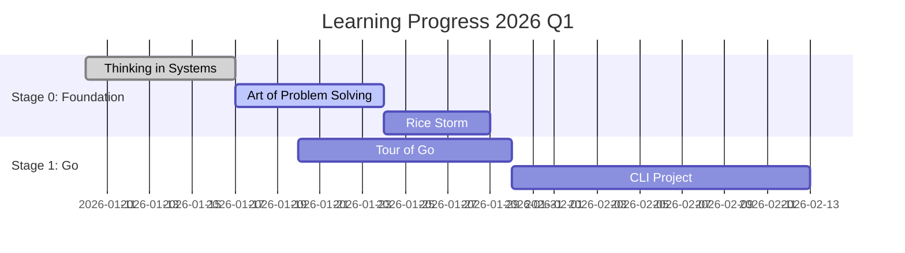
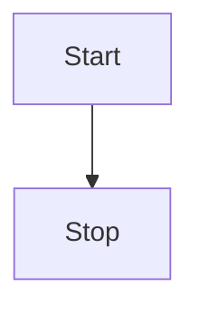

# 2026 Learning Journey

> Detailed plan and progress tracking for 2026

## 🎯 Goal
Strengthen System Analyst skills, transition towards Software Architect role, and develop technical leadership capabilities.

## 📅 Quarterly Focus

### Q1 2026: Foundation & Technical Base
- [ ] Complete Stage 0: Systems Thinking
- [ ] Complete Stage 1: Go Programming + CLI project
- [ ] Start Stage 2: Networks & SQL

### Q2 2026: Infrastructure & Architecture Basics
- [ ] Complete Stage 2: Networks & Protocols  
- [ ] Complete Stage 3: Cloud & Infrastructure
- [ ] Start Stage 4: DDD & Design Patterns

## 📊 Progress Tracking
- **Books read:** 0/10 (0%)
- **Projects completed:** 0/5 (0%)
- **ADRs created:** 1/10 (10%)

## 🔗 Links
- [Detailed 2026 Plan](00-PLAN-AND-META/2026-learning-plan.md)
- [Progress Spreadsheet](https://...) *если выложите Excel*

# 🚀 План развития системного аналитика на 2026 год

## 📊 Прогресс
**0% выполнено (0/20 задач)**

*Последнее обновление: 16.01.2026*

## 🎯 Цели на год
- Освоить системное и архитектурное мышление
- Получить практический опыт разработки на Go
- Понимать полный цикл от требований до эксплуатации
- Подготовиться к роли Lead/Architect Analyst

## 📁 Структура репозитория
- [📋 Чеклист прогресса](./01-CHECKLIST.md)
- [📚 Этапы обучения](./02-STAGES/)
- [✅ Практические вехи](./03-MILESTONES/)
- [💻 Проекты на Go](./04-PROJECTS/)
- [📖 Дополнительные материалы](./05-RESOURCES/)
- [🤖 Скрипты автоматизации](./06-SCRIPTS/)
- [📄 Оригинальные файлы](./07-PDF/)

## 🗓️ Сроки (из плана)
- **Q1 2026**: Завершить Этап 0 и Этап 1
- **Q2 2026**: Этап 2 и Этап 3

## 🚦 Текущий фокус
🔸 Читаю: *Thinking in Systems* (Donella Meadows)  
🔸 Практика: *Tour of Go*  
🔸 Задача: *Создать CLI-утилиту на Go*
